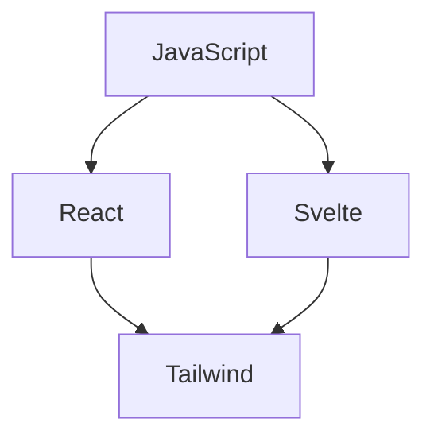

# Hey This is Rashid Bik
- 🔭 I’m currently working on three js and webGl
- 🌱 I’m currently learning react-natve and aws
- 👯 I’m looking to collaborate on complex ECommerce apps
- 🤔 I’m looking for help with upgrading people mind
- 💬 Ask me about react and tailwind
- 📫 How to reach me: +93793350791
- 😄 Pronouns: bAdfOx comes in the picture
- ⚡ Fun fact: I Enjoy diving into errors
- lets take our hand and fly

## "Ask the successful person how to finish a work..!!  But  Ask the Experience person how to start a work..!!"

My Fun Flow Chart! :shipit:

$$\left( \sum_{k=1}^n a_k b_k \right)^2 \leq \left( \sum_{k=1}^n a_k^2 \right) \left( \sum_{k=1}^n b_k^2 \right)$$
